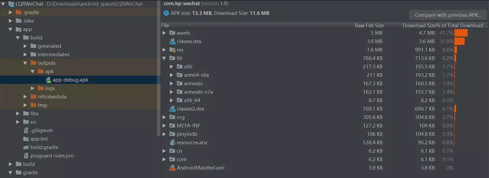
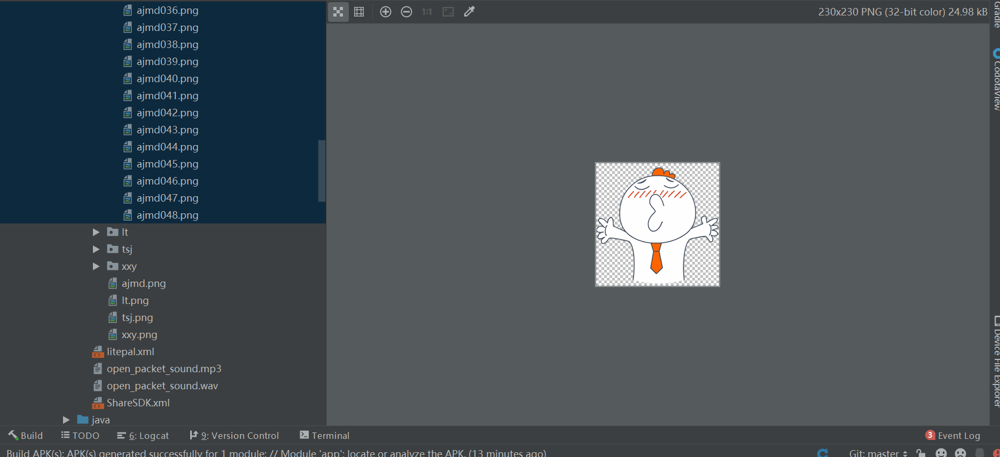
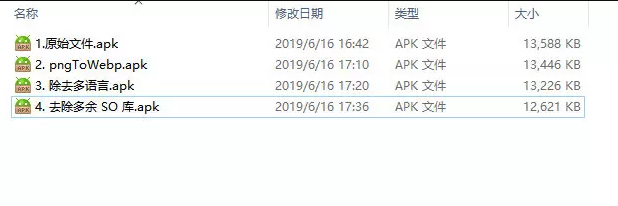
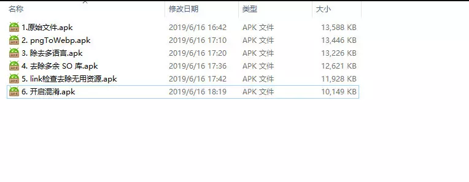
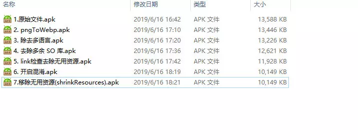
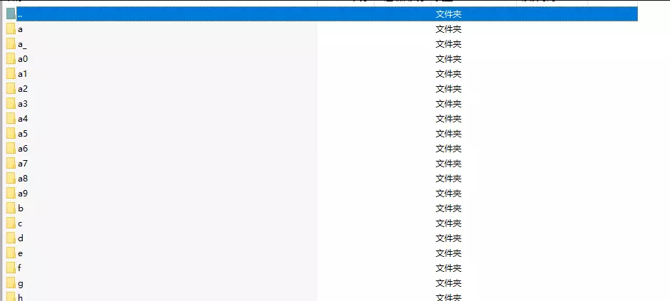
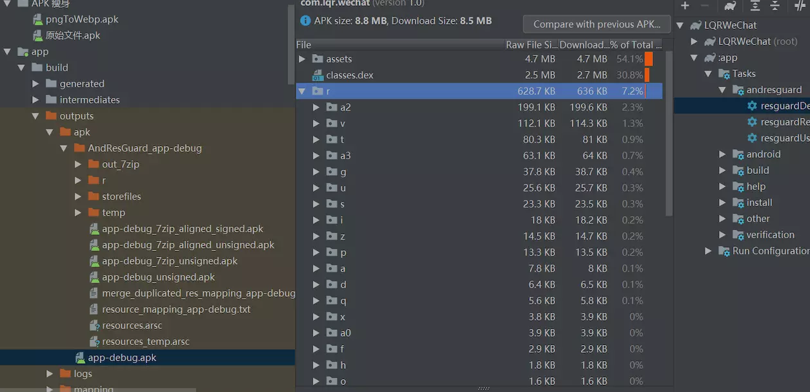

#### 腾讯---类比于微信，如何对Apk进行极限压缩,谈下Android压缩8大步

本专栏专注分享大型Bat面试知识，后续会持续更新，喜欢的话麻烦点击一个star

> **面试官:  类比于微信，如何对Apk进行极限压缩,谈下Android压缩8大步**


> **心理分析**：面试官是非常注重性能优化的，考求职者是否具备APK压缩技能。

> **求职者:**应该从每一步压缩开始，压缩的过程本质是挤牙膏的过程，一步一步挤。将Apk压缩分为8个步骤


## 简介

随着项目的不断迭代，代码量跟资源文件不断增多。那么就会出现打包后的 APK 文件越来越大，如果突然有一天你们老板或领导叫你优化 APK 大小，你还不知道怎么优化那就有点说不过去了，这篇文章咱们就来一起分析并优化 APK 体积大小吧。

## 分析 APK 资源占用

*注意:*

我是在 GitHub 找了一个人气比较高的开源项目，需要的话自己可以点击[下载](https://link.juejin.im?target=https%3A%2F%2Fgithub.com%2FGitLqr%2FLQRWeChat)，自己动手尝试一番.





分析工具直接用的 AS Build/Analyze APK

从上面图中得出 assets > classes.dex > res > lib 其中资源文件占用最大。

下面我们就来看看怎么减小 APK 大小吧，

## 优化 APK 体积八大步

### 1. 将图片转换为 webp 格式

#### Webp 概念

WebP 是一种同时提供了有损压缩与无损压缩的图片文件格式，派生自视频编码格式 VP8。WebP 最初在2010年发布，目标是减少文件大小，但达到 和 JEPG 格式相同的图片质量，希望能够减少图片档在网络上的发送时间。2011年11月8日，Google 开始让 WebP 支持无损压缩和透明色的功能。

根据 Google 较早的测试，WebP 的无损压缩比网络上找到的 PNG  档少了 45％ 的文件大小，即使这些 PNG 档在使用 PNGCRUSH 和 PNGOUT 处理过，WebP 还是可以减少 28％ 的文件大小。就目前而言，Webp 可以让图片大小平均减少 70% 。WebP 是未来图片格式的发展趋势。

#### PNG / JPG to Webp





点击图片或者文件夹右键选择 Convert to Webp 格式，将 png / jpg 图片压缩为 webp 格式图片.


最后我们只减少了不到 200 kb 左右，有可能项目图片资源本来就没有多大，只是太多小图片导致的。

#### 应用场景及优势

- 客户端软件，内嵌了基于 Chromium 的 webview，这类浏览器中应用的网页是可以完全使用WebP 格式，提升加载渲染速度，不考虑兼容。
- 用 node-webkit 开发的程序，用 WebP 可以减少文件包的体积。
- 移动应用 或 网页游戏 ,界面需要大量图片,可以嵌入 WebP 的解码包，能够节省用户流量，提升访问速度优势：
- 对于 PNG 图片，WebP 比 PNG 小了45%。

### 2. 去除多语言

在 app/build.gradle 添加

```
android{
    ...
    defaultConfig{
        ...
        //只保留英语
        resConfigs "en"
    }
}
复制代码
```


这里我们发现减少了大概 200 kb

### 3. 去除不必要 so 库

通过反编译 Android 微信版本 得知，微信也只适配了 armeabi-v7a 架构，那么我们删掉其它库的支持吧。

```
android{
    ...
    defaultConfig{
        ...
            ndk {
            //设置支持的SO库架构
            abiFilters "armeabi-v7a"
     }
}
}

复制代码
```





又优化了差不多 600 kb ,继续。

### 4. 去除无用资源 Link 检查（谨慎删除）

#### 概念

Lint 是 Android Studio 提供的 代码扫描分析工具，它可以帮助我们发现代码结构 / 质量问题，同时提供一些解决方案，而且这个过程不需要我们手写测试用例。代码迭代版本一多，很容易会遗留一些无用的代码、资源文件，我们可以使用 Lint 进行清除。

#### 怎么使用 Link 检查

打开 AS 工具，找到 Analyze >  Run Inspection By Name > unused resources

#### 优化


发现我们 link 大概优化了 700 kb继续。

#### 注意

因为 link 是检查有没有引用来做的判断是否使用了资源，那么如果是这种方式勒，所以在删除的时候一定要谨慎。

```
//动态获取资源 id , 未直接使用 R.xx.xx ，则这个 id 代表的资源会被认为没有使用过(类似不能混淆反射类)
int indetifier =getResources().getIdentifier("img_bubble_receive", "drawable", getPackageName()); getResources().getDrawable(indetifier);

复制代码
```

### 5. 开启混淆

如果有不了解 混淆 是什么的可以建议去看下我上一遍文章 [性能优化 (十一) ProGuard 对代码和资源压缩](https://juejin.im/post/5d05dab06fb9a07ea9446e21)





优化了大概 1.7M 继续。

### 6.移除无用资源 shinkResource

- 开启 shinkResource = true

  ```
      buildTypes {
          release {
              minifyEnabled true
              shrinkResources = true
  
              proguardFiles getDefaultProguardFile('proguard-android.txt'), 'proguard-rules.pro'
          }
          debug {
              shrinkResources = true
              minifyEnabled true
              proguardFiles getDefaultProguardFile('proguard-android.txt'), 'proguard-rules.pro'
          }
      }
  复制代码
  ```

  

  

  

这个有可能 link 删除了无用资源，所以没有在优化了

### 7.开启删除无用资源 (严格模式和普通模式) - 这个我这里就不可测试，你们下来可以测试下效果

#### 普通模式也就是自定义模式

如果您有想要保留或舍弃的特定资源，请在您的项目中创建一个包含 `<resources>` 标记的 XML 文件，并在 `tools:keep` 属性中指定每个要保留的资源，在 `tools:discard` 属性中指定每个要舍弃的资源。这两个属性都接受逗号分隔的资源名称列表。您可以使用星号字符作为通配符。

例如：

```
<?xml version="1.0" encoding="utf-8"?>
<resources xmlns:tools="http://schemas.android.com/tools"
    tools:keep="@layout/l_used*_c,@layout/l_used_a,@layout/l_used_b*"
    tools:discard="@layout/unused2" />
复制代码
```

将该文件保存在项目资源中，例如，保存在 `res/raw/keep.xml`。构建不会将该文件打包到 APK 之中。

指定要舍弃的资源可能看似愚蠢，因为您本可将它们删除，但在使用构建变体时，这样做可能很有用。例如，如果您明知给定资源表面上会在代码中使用（并因此不会被压缩器移除），但实际不会用于给定构建变体，就可以将所有资源放入公用项目目录，然后为每个构建变体创建一个不同的 `keep.xml` 文件。构建工具也可能无法根据需要正确识别资源，这是因为编译器会添加内联资源 ID，而资源分析器可能不知道真正引用的资源和恰巧具有相同值的代码中的整数值之间的差别。

#### 严格模式

正常情况下，资源压缩器可准确判定系统是否使用了资源。不过，如果您的代码调用 `Resources.getIdentifier()`（或您的任何库进行了这一调用 - [AppCompat](https://link.juejin.im?target=https%3A%2F%2Fdeveloper.android.com%2Ftopic%2Flibraries%2Fsupport-library%2Ffeatures.html%3Fhl%3Dzh-cn%23v7-appcompat) 库会执行该调用），这就表示您的代码将根据动态生成的字符串查询资源名称。当您执行这一调用时，默认情况下资源压缩器会采取防御性行为，将所有具有匹配名称格式的资源标记为可能已使用，无法移除。

例如，以下代码会使所有带 `img_` 前缀的资源标记为已使用。

```
String name = String.format("img_%1d", angle + 1);
res = getResources().getIdentifier(name, "drawable", getPackageName());
复制代码
```

资源压缩器还会浏览代码以及各种 `res/raw/` 资源中的所有字符串常量，寻找格式类似于 `file:///android_res/drawable//ic_plus_anim_016.png` 的资源网址。如果它找到与其类似的字符串，或找到其他看似可用来构建与其类似的网址的字符串，则不会将它们移除。

这些是默认情况下启用的安全压缩模式的示例。但您可以停用这一“有备无患”处理方式，并指定资源压缩器只保留其确定已使用的资源。要执行此操作，请在 `keep.xml` 文件中将 `shrinkMode` 设置为 `strict`，如下所示：

```
<?xml version="1.0" encoding="utf-8"?>
<resources xmlns:tools="http://schemas.android.com/tools"
    tools:shrinkMode="strict" />
复制代码
```

如果您确已启用严格压缩模式，并且代码也引用了包含动态生成字符串的资源（如上所示），则必须利用 `tools:keep` 属性手动保留这些资源。

### 8. [AndResGuard 微信资源压缩方案](https://link.juejin.im?target=https%3A%2F%2Fgithub.com%2Fshwenzhang%2FAndResGuard)

#### 什么是 AndResGuard

AndResGuard 是一个缩小 APK 大小的工具，它的原理类似 Java Proguard ，但是只针对资源。它会将原本冗长的资源路径变短，例如将 res/drawable/wechat 变为 r/d/a。

#### 为什么使用 AndResGuard

在以往的开发中，我们通常只混淆了代码，资源文件却暴露在他人面前，res 文件夹下所有文件名的可读性过强。

#### 使用后的效果





 

#### AndResGuard 的配置

- 项目根目录下 build.gradle 中，添加插件的依赖：

  ```
   dependencies {
          classpath 'com.tencent.mm:AndResGuard-gradle-plugin:1.2.16'
      }
  复制代码
  ```

- 在 app 目录下，创建 **and_res_guard.gradle** 文件

```
apply plugin: 'AndResGuard'

andResGuard {
    mappingFile = null
    use7zip = true
    useSign = true
    keepRoot = false
    compressFilePattern = [
            "*.png",
            "*.jpg",
            "*.jpeg",
            "*.gif",
            "resources.arsc"
    ]
    whiteList = [
            // your icon
            "R.drawable.icon",
            // for fabric
            "R.string.com.crashlytics.*",
            // for umeng update
            "R.string.tb_*",
            "R.layout.tb_*",
            "R.drawable.tb_*",
            "R.drawable.u1*",
            "R.drawable.u2*",
            "R.color.tb_*",
            // umeng share for sina
            "R.drawable.sina*",
            // for google-services.json
            "R.string.google_app_id",
            "R.string.gcm_defaultSenderId",
            "R.string.default_web_client_id",
            "R.string.ga_trackingId",
            "R.string.firebase_database_url",
            "R.string.google_api_key",
            "R.string.google_crash_reporting_api_key",

            //友盟
            "R.string.umeng*",
            "R.string.UM*",
            "R.layout.umeng*",
            "R.drawable.umeng*",
            "R.id.umeng*",
            "R.anim.umeng*",
            "R.color.umeng*",
            "R.style.*UM*",
            "R.style.umeng*",

            //融云
            "R.drawable.u*",
            "R.drawable.rc_*",
            "R.string.rc_*",
            "R.layout.rc_*",
            "R.color.rc_*",
            "R.id.rc_*",
            "R.style.rc_*",
            "R.dimen.rc_*",
            "R.array.rc_*"
    ]

    sevenzip {
        artifact = 'com.tencent.mm:SevenZip:1.2.10'
    }
}

复制代码
```

- 在 app 模块下的 build.gradle 文件添加

  ```
  apply from: 'and_res_guard.gradle'
  复制代码
  ```

- 打包完之后效果图

  

  

  

- 

  

  

资源压缩了大概 1M

## 总结

1. 项目体积越大，资源越多，效果就越明显。
2. 使用 Link 删除资源的话，一定要谨慎，提前做好备份。
3. 咱们这里因为项目本身只有 22 M 多，最后优化了 4.5 M 下去。也还是很不容易的。