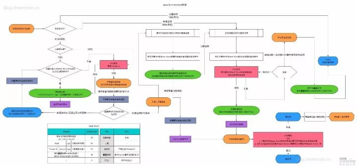

#### 腾讯---synchronize关键字在虚拟机执行原理是什么，能谈一谈什么是内存可见性，锁升级吗

本专栏专注分享大型Bat面试知识，后续会持续更新，喜欢的话麻烦点击一个star

> **面试官:  synchronize关键字在虚拟机执行原理是什么，能谈一谈什么是内存可见性，锁升级吗**


> **心理分析**：面试官一定是想深入考你并发的内容，看你究竟有没有做过并发处理，大多数开发者在开发App时
>
> 往往会忽略调并发处理 ，这道题会难住绝大多数人。

> **求职者:**应该存 锁的执行原理，锁优化 ，和java对象头说起


## **锁的内存语义**

synchronized的底层是使用操作系统的mutex lock实现的。

- **内存可见性：**同步快的可见性是由“如果对一个变量执行lock操作，将会清空工作内存中此变量的值，在执行引擎使用这个变量前需要重新执行load或assign操作初始化变量的值”、“对一个变量执行unlock操作之前，必须先把此变量同步回主内存中（执行store和write操作）”这两条规则获得的。
- **操作原子性：**持有同一个锁的两个同步块只能串行地进入

**锁的内存语义：**

- 当线程释放锁时，JMM会把该线程对应的本地内存中的共享变量刷新到主内存中
- 当线程获取锁时，JMM会把该线程对应的本地内存置为无效。从而使得被监视器保护的临界区代码必须从主内存中读取共享变量

**锁释放和锁获取的内存语义：**

- 线程A释放一个锁，实质上是线程A向接下来将要获取这个锁的某个线程发出了（线程A对共享变量所做修改的）消息。
- 线程B获取一个锁，实质上是线程B接收了之前某个线程发出的（在释放这个锁之前对共享变量所做修改的）消息。
- 线程A释放锁，随后线程B获取这个锁，这个过程实质上是线程A通过主内存向线程B发送消息


## **synchronized锁**

synchronized用的锁是存在Java对象头里的。

JVM基于进入和退出Monitor对象来实现方法同步和代码块同步。代码块同步是使用monitorenter和monitorexit指令实现的，monitorenter指令是在编译后插入到同步代码块的开始位置，而monitorexit是插入到方法结束处和异常处。任何对象都有一个monitor与之关联，当且一个monitor被持有后，它将处于锁定状态。

根据虚拟机规范的要求，在执行monitorenter指令时，首先要去尝试获取对象的锁，如果这个对象没被锁定，或者当前线程已经拥有了那个对象的锁，把锁的计数器加1；相应地，在执行monitorexit指令时会将锁计数器减1，当计数器被减到0时，锁就释放了。如果获取对象锁失败了，那当前线程就要阻塞等待，直到对象锁被另一个线程释放为止。

注意两点：

1、synchronized同步快对同一条线程来说是可重入的，不会出现自己把自己锁死的问题；

2、同步块在已进入的线程执行完之前，会阻塞后面其他线程的进入。

## **Mutex Lock**

监视器锁（Monitor）本质是依赖于底层的操作系统的Mutex Lock（互斥锁）来实现的。每个对象都对应于一个可称为" 互斥锁" 的标记，这个标记用来保证在任一时刻，只能有一个线程访问该对象。

互斥锁：用于保护临界区，确保同一时间只有一个线程访问数据。对共享资源的访问，先对互斥量进行加锁，如果互斥量已经上锁，调用线程会阻塞，直到互斥量被解锁。在完成了对共享资源的访问后，要对互斥量进行解锁。

**mutex的工作方式：**


- 1) 申请mutex
- 2) 如果成功，则持有该mutex
- 3) 如果失败，则进行spin自旋. spin的过程就是在线等待mutex, 不断发起mutex gets, 直到获得mutex或者达到spin_count限制为止
- 4) 依据工作模式的不同选择yiled还是sleep
- 5) 若达到sleep限制或者被主动唤醒或者完成yield, 则重复1)~4)步，直到获得为止

由于Java的线程是映射到操作系统的原生线程之上的，如果要阻塞或唤醒一条线程，都需要操作系统来帮忙完成，这就需要从用户态转换到核心态中，因此状态转换需要耗费很多的处理器时间。所以synchronized是Java语言中的一个重量级操作。在JDK1.6中，虚拟机进行了一些优化，譬如在通知操作系统阻塞线程之前加入一段自旋等待过程，避免频繁地切入到核心态中：

synchronized与java.util.concurrent包中的ReentrantLock相比，由于JDK1.6中加入了针对锁的优化措施（见后面），使得synchronized与ReentrantLock的性能基本持平。ReentrantLock只是提供了synchronized更丰富的功能，而不一定有更优的性能，所以在synchronized能实现需求的情况下，优先考虑使用synchronized来进行同步。

## **Java对象头**


在运行期间，Mark Word里存储的数据会随着锁标志位的变化而变化，以32位的JDK为例：


## **锁优化**

## **偏向锁、轻量级锁、重量级锁**

Synchronized是通过对象内部的一个叫做监视器锁（monitor）来实现的，监视器锁本质又是依赖于底层的操作系统的Mutex Lock（互斥锁）来实现的。而操作系统实现线程之间的切换需要从用户态转换到核心态，这个成本非常高，状态之间的转换需要相对比较长的时间，这就是为什么Synchronized效率低的原因。因此，这种依赖于操作系统Mutex Lock所实现的锁我们称之为“重量级锁”。

Java SE 1.6为了减少获得锁和释放锁带来的性能消耗，引入了“偏向锁”和“轻量级锁”：锁一共有4种状态，级别从低到高依次是：无锁状态、偏向锁状态、轻量级锁状态和重量级锁状态。锁可以升级但不能降级。

## **偏向锁**

HotSpot的作者经过研究发现，大多数情况下，锁不仅不存在多线程竞争，而且总是由同一线程多次获得。偏向锁是为了在只有一个线程执行同步块时提高性能。

当一个线程访问同步块并获取锁时，会在对象头和栈帧中的锁记录里存储锁偏向的线程ID，以后该线程在进入和退出同步块时不需要进行CAS操作来加锁和解锁，只需简单地测试一下对象头的Mark Word里是否存储着指向当前线程的偏向锁。引入偏向锁是为了在无多线程竞争的情况下尽量减少不必要的轻量级锁执行路径，因为轻量级锁的获取及释放依赖多次CAS原子指令，而偏向锁只需要在置换ThreadID的时候依赖一次CAS原子指令（由于一旦出现多线程竞争的情况就必须撤销偏向锁，所以偏向锁的撤销操作的性能损耗必须小于节省下来的CAS原子指令的性能消耗）。

**偏向锁获取过程：**

- （1）访问Mark Word中偏向锁的标识是否设置成1，锁标志位是否为01——确认为可偏向状态。
- （2）如果为可偏向状态，则测试线程ID是否指向当前线程，如果是，进入步骤（5），否则进入步骤（3）。
- （3）如果线程ID并未指向当前线程，则通过CAS操作竞争锁。如果竞争成功，则将Mark Word中线程ID设置为当前线程ID，然后执行（5）；如果竞争失败，执行（4）。
- （4）如果CAS获取偏向锁失败，则表示有竞争（CAS获取偏向锁失败说明至少有过其他线程曾经获得过偏向锁，因为线程不会主动去释放偏向锁）。当到达全局安全点（safepoint）时，会首先暂停拥有偏向锁的线程，然后检查持有偏向锁的线程是否活着（因为可能持有偏向锁的线程已经执行完毕，但是该线程并不会主动去释放偏向锁），如果线程不处于活动状态，则将对象头设置成无锁状态（标志位为“01”），然后重新偏向新的线程；如果线程仍然活着，撤销偏向锁后升级到轻量级锁状态（标志位为“00”），此时轻量级锁由原持有偏向锁的线程持有，继续执行其同步代码，而正在竞争的线程会进入自旋等待获得该轻量级锁。
- （5）执行同步代码。

**偏向锁的释放过程：**

如上步骤（4）。偏向锁使用了一种等到竞争出现才释放偏向锁的机制：偏向锁只有遇到其他线程尝试竞争偏向锁时，持有偏向锁的线程才会释放锁，线程不会主动去释放偏向锁。偏向锁的撤销，需要等待全局安全点（在这个时间点上没有字节码正在执行），它会首先暂停拥有偏向锁的线程，判断锁对象是否处于被锁定状态，撤销偏向锁后恢复到未锁定（标志位为“01”）或轻量级锁（标志位为“00”）的状态。

**关闭偏向锁：**

偏向锁在Java 6和Java 7里是默认启用的。由于偏向锁是为了在只有一个线程执行同步块时提高性能，如果你确定应用程序里所有的锁通常情况下处于竞争状态，可以通过JVM参数关闭偏向锁：-XX:-UseBiasedLocking=false，那么程序默认会进入轻量级锁状态。

## **轻量级锁**

轻量级锁是为了在线程近乎交替执行同步块时提高性能。

**轻量级锁的加锁过程：**

- （1）在代码进入同步块的时候，如果同步对象锁状态为无锁状态（锁标志位为“01”状态，是否为偏向锁为“0”），虚拟机首先将在当前线程的栈帧中建立一个名为锁记录（Lock Record）的空间，用于存储锁对象目前的Mark Word的拷贝，官方称之为 Displaced Mark Word。这时候线程堆栈与对象头的状态如下图所示。


- （2）拷贝对象头中的Mark Word复制到锁记录中。
- （3）拷贝成功后，虚拟机将使用CAS操作尝试将对象的Mark Word更新为指向Lock Record的指针，并将Lock record里的owner指针指向object mark word。如果更新成功，则执行步骤（3），否则执行步骤（4）。
- （4）如果这个更新动作成功了，那么这个线程就拥有了该对象的锁，并且对象Mark Word的锁标志位设置为“00”，即表示此对象处于轻量级锁定状态，这时候线程堆栈与对象头的状态如下图所示。


- （5）如果这个更新操作失败了，虚拟机首先会检查对象的Mark Word是否指向当前线程的栈帧，如果是就说明当前线程已经拥有了这个对象的锁，那就可以直接进入同步块继续执行。否则说明多个线程竞争锁，若当前只有一个等待线程，则可通过自旋稍微等待一下，可能另一个线程很快就会释放锁。 但是当自旋超过一定的次数，或者一个线程在持有锁，一个在自旋，又有第三个来访时，轻量级锁膨胀为重量级锁，重量级锁使除了拥有锁的线程以外的线程都阻塞，防止CPU空转，锁标志的状态值变为“10”，Mark Word中存储的就是指向重量级锁（互斥量）的指针，后面等待锁的线程也要进入阻塞状态。

**轻量级锁的解锁过程：**

- （1）通过CAS操作尝试把线程中复制的Displaced Mark Word对象替换当前的Mark Word。
- （2）如果替换成功，整个同步过程就完成了。
- （3）如果替换失败，说明有其他线程尝试过获取该锁（此时锁已膨胀），那就要在释放锁的同时，唤醒被挂起的线程。

## **重量级锁**

如上轻量级锁的加锁过程步骤（5），轻量级锁所适应的场景是线程近乎交替执行同步块的情况，如果存在同一时间访问同一锁的情况，就会导致轻量级锁膨胀为重量级锁。Mark Word的锁标记位更新为10，Mark Word指向互斥量（重量级锁）

Synchronized的重量级锁是通过对象内部的一个叫做监视器锁（monitor）来实现的，监视器锁本质又是依赖于底层的操作系统的Mutex Lock（互斥锁）来实现的。而操作系统实现线程之间的切换需要从用户态转换到核心态，这个成本非常高，状态之间的转换需要相对比较长的时间，这就是为什么Synchronized效率低的原因。

（具体见前面的mutex lock）

## **偏向锁、轻量级锁、重量级锁之间转换**




偏向所锁，轻量级锁都是乐观锁，重量级锁是悲观锁。

- 一个对象刚开始实例化的时候，没有任何线程来访问它的时候。它是可偏向的，意味着，它现在认为只可能有一个线程来访问它，所以当第一个线程来访问它的时候，它会偏向这个线程，此时，对象持有偏向锁。偏向第一个线程，这个线程在修改对象头成为偏向锁的时候使用CAS操作，并将对象头中的ThreadID改成自己的ID，之后再次访问这个对象时，只需要对比ID，不需要再使用CAS在进行操作。
- 一旦有第二个线程访问这个对象，因为偏向锁不会主动释放，所以第二个线程可以看到对象时偏向状态，这时表明在这个对象上已经存在竞争了。检查原来持有该对象锁的线程是否依然存活，如果挂了，则可以将对象变为无锁状态，然后重新偏向新的线程。如果原来的线程依然存活，则马上执行那个线程的操作栈，检查该对象的使用情况，如果仍然需要持有偏向锁，则偏向锁升级为轻量级锁，（**偏向锁就是这个时候升级为轻量级锁的**），此时轻量级锁由原持有偏向锁的线程持有，继续执行其同步代码，而正在竞争的线程会进入自旋等待获得该轻量级锁；如果不存在使用了，则可以将对象回复成无锁状态，然后重新偏向。
- 轻量级锁认为竞争存在，但是竞争的程度很轻，一般两个线程对于同一个锁的操作都会错开，或者说稍微等待一下（自旋），另一个线程就会释放锁。 但是当自旋超过一定的次数，或者一个线程在持有锁，一个在自旋，又有第三个来访时，**轻量级锁膨胀为重量级锁**，重量级锁使除了拥有锁的线程以外的线程都阻塞，防止CPU空转。

## **其他锁优化**

## **锁消除**

锁消除即删除不必要的加锁操作。虚拟机即时编辑器在运行时，对一些“代码上要求同步，但是被检测到不可能存在共享数据竞争”的锁进行消除。

根据代码逃逸技术，如果判断到一段代码中，堆上的数据不会逃逸出当前线程，那么可以认为这段代码是线程安全的，不必要加锁。

看下面这段程序：

```text
public class SynchronizedTest {

    public static void main(String[] args) {
        SynchronizedTest test = new SynchronizedTest();

        for (int i = 0; i < 100000000; i++) {
            test.append("abc", "def");
        }
    }

    public void append(String str1, String str2) {
        StringBuffer sb = new StringBuffer();
        sb.append(str1).append(str2);
    }
}
```

虽然StringBuffer的append是一个同步方法，但是这段程序中的StringBuffer属于一个局部变量，并且不会从该方法中逃逸出去（即StringBuffer sb的引用没有传递到该方法外，不可能被其他线程拿到该引用），所以其实这过程是线程安全的，可以将锁消除。

## **锁粗化**

如果一系列的连续操作都对同一个对象反复加锁和解锁，甚至加锁操作是出现在循环体中的，那即使没有出现线程竞争，频繁地进行互斥同步操作也会导致不必要的性能损耗。

如果虚拟机检测到有一串零碎的操作都是对同一对象的加锁，将会把加锁同步的范围扩展（粗化）到整个操作序列的外部。

举个例子：

```text
public class StringBufferTest {
    StringBuffer stringBuffer = new StringBuffer();

    public void append(){
        stringBuffer.append("a");
        stringBuffer.append("b");
        stringBuffer.append("c");
    }
}
```

这里每次调用stringBuffer.append方法都需要加锁和解锁，如果虚拟机检测到有一系列连串的对同一个对象加锁和解锁操作，就会将其合并成一次范围更大的加锁和解锁操作，即在第一次append方法时进行加锁，最后一次append方法结束后进行解锁。

## **自旋锁与自适应自旋锁**

- **引入自旋锁的原因：**互斥同步对性能最大的影响是阻塞的实现，因为挂起线程和恢复线程的操作都需要转入内核态中完成，这些操作给系统的并发性能带来很大的压力。同时虚拟机的开发团队也注意到在许多应用上面，共享数据的锁定状态只会持续很短一段时间，为了这一段很短的时间频繁地阻塞和唤醒线程是非常不值得的。
- **自旋锁：**让该线程执行一段无意义的忙循环（自旋）等待一段时间，不会被立即挂起（自旋不放弃处理器额执行时间），看持有锁的线程是否会很快释放锁。自旋锁在JDK 1.4.2中引入，默认关闭，但是可以使用-XX:+UseSpinning开开启；在JDK1.6中默认开启。
- **自旋锁的缺点：**自旋等待不能替代阻塞，虽然它可以避免线程切换带来的开销，但是它占用了处理器的时间。如果持有锁的线程很快就释放了锁，那么自旋的效率就非常好；反之，自旋的线程就会白白消耗掉处理器的资源，它不会做任何有意义的工作，这样反而会带来性能上的浪费。所以说，自旋等待的时间（自旋的次数）必须要有一个限度，例如让其循环10次，如果自旋超过了定义的时间仍然没有获取到锁，则应该被挂起（进入阻塞状态）。通过参数-XX:PreBlockSpin可以调整自旋次数，默认的自旋次数为10。
- **自适应的自旋锁：**JDK1.6引入自适应的自旋锁，自适应就意味着自旋的次数不再是固定的，它是由前一次在同一个锁上的自旋时间及锁的拥有者的状态来决定：如果在同一个锁的对象上，自旋等待刚刚成功获得过锁，并且持有锁的线程正在运行中，那么虚拟机就会认为这次自旋也很有可能再次成功，进而它将允许自旋等待持续相对更长的时间。如果对于某个锁，自旋很少成功获得过，那在以后要获取这个锁时将可能省略掉自旋过程，以避免浪费处理器资源。简单来说，就是线程如果自旋成功了，则下次自旋的次数会更多，如果自旋失败了，则自旋的次数就会减少。
- **自旋锁使用场景：**从轻量级锁获取的流程中我们知道，当线程在获取轻量级锁的过程中执行CAS操作失败时，是要通过自旋来获取重量级锁的。（见前面“轻量级锁”）

## **总结**

- **synchronized特点：**保证内存可见性、操作原子性

- **synchronized影响性能的原因**：

- - 1、加锁解锁操作需要额外操作；
  - 2、互斥同步对性能最大的影响是阻塞的实现，因为阻塞涉及到的挂起线程和恢复线程的操作都需要转入内核态中完成（用户态与内核态的切换的性能代价是比较大的）

- **synchronized锁**：对象头中的Mark Word根据锁标志位的不同而被复用

- - 偏向锁：在只有一个线程执行同步块时提高性能。Mark Word存储锁偏向的线程ID，以后该线程在进入和退出同步块时不需要进行CAS操作来加锁和解锁，只需简单比较ThreadID。特点：只有等到线程竞争出现才释放偏向锁，持有偏向锁的线程不会主动释放偏向锁。之后的线程竞争偏向锁，会先检查持有偏向锁的线程是否存活，如果不存货，则对象变为无锁状态，重新偏向；如果仍存活，则偏向锁升级为轻量级锁，此时轻量级锁由原持有偏向锁的线程持有，继续执行其同步代码，而正在竞争的线程会进入自旋等待获得该轻量级锁
  - 轻量级锁：在当前线程的栈帧中建立一个名为锁记录（Lock Record）的空间，尝试拷贝锁对象目前的Mark Word到栈帧的Lock Record，若拷贝成功：虚拟机将使用CAS操作尝试将对象的Mark Word更新为指向Lock Record的指针，并将Lock record里的owner指针指向对象的Mark Word。若拷贝失败：若当前只有一个等待线程，则可通过自旋稍微等待一下，可能持有轻量级锁的线程很快就会释放锁。 但是当自旋超过一定的次数，或者一个线程在持有锁，一个在自旋，又有第三个来访时，轻量级锁膨胀为重量级锁
  - 重量级锁：指向互斥量（mutex），底层通过操作系统的mutex lock实现。等待锁的线程会被阻塞，由于Linux下Java线程与操作系统内核态线程一一映射，所以涉及到用户态和内核态的切换、操作系统内核态中的线程的阻塞和恢复。